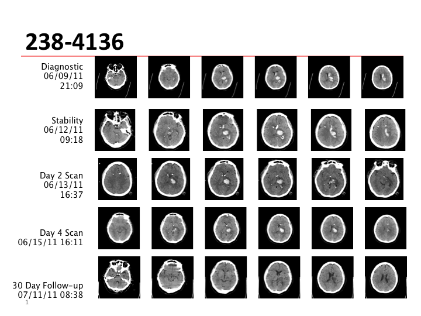
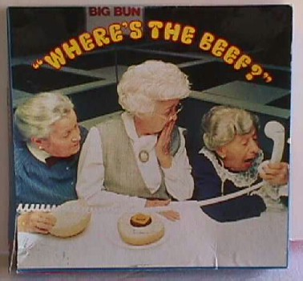

## R programs used for this presentation

* `knitr` [Xie (2013)] - compiles R code within markdown
* `slidify` [Vaidyanathan (2012)] - makes awesome slide decks (in html)
* `knitcitations` [Boettiger (2013)] - allows my BibTeX to cite in `knitr`
* `RStudio` [RStudio (2013)] - integrated R IDE

---

## 3D Graphics?


---


## I'm not referring to 3D histograms

* 3D is not good just because of one more D
* 3D data representing 2D is still bad
  * No 3D Pie charts/histograms
  * See Karl Broman's [The top ten worst graphs](http://www.biostat.wisc.edu/~kbroman/topten_worstgraphs/)


<p> </p>

---

## Why care about/do imaging?

* Non-invasive (think <span class="black">craniotomy</span>)
* Potential biomarkers - early identification
  * Lesions in MS
  * Plaques in Alzheimer's
  * White matter volume
  * Cortical thickness

* Outcome measures
  * Stroke - amount of blood
  * Brain activity

---

## Neuroimaging Data 


---


## Neuroimaging Data 
What kind of data do we have?
* <span class = "green"><b>Structural MRIs</b></span>
* Functional MRIs
* Computed Tomography - <span class = "green"><b>CT</b></span>
* Diffusion Tensor Imaging (DTI)
* Electroencephalography (EEG)
* Positron Emission Tomography (PET)
* etc. 

<span class="black"><b>Visualization</b></span> and <span class="black"><b>presentation</b></span> of these data can be <span class="black"><b>improved</b></span> with the use of 3D tools.

---


## Overall Message

* 3D (<span class="red"><b>neuroimaging</b></span>)  figures can be created/<span class="red"><b>exported easily</b></span>
 
* <span class="red"><b>Standalone</b></span> objects are needed for end-users/readers
 
*  <span class="red"><b>Webpages</b></span> are a good medium for these
 
* We need to figure how to effectively incorporate into pipelines/<span class="red"><b>publications</b></span>


---


## 3D rendering tools out there

* <span class = 'green'>RGL</span> (R Graphics Library) [Adler & Murdoch, 2013] using `R` - http://cran.r-project.org/
* <span class = 'green'>3D Slicer</span> - http://www.slicer.org/ - xtk based
* Paraview - http://www.paraview.org/
* Freesurfer - http://surfer.nmr.mgh.harvard.edu/
* AFNI - http://afni.nimh.nih.gov/afni
* MIPAV - http://mipav.cit.nih.gov/
* Matlab
* http://slicedrop.com/ - TRY THIS - xtk-based
* Many more

---


## Current methods of visualizing/EDA
* "Lightbox" - using image.nifti from `oro.nifti`  [Whitcher _et. al._ (2011)] package:

<span class="black"><b>Read left to right like a book - down the page is down the brain</b></span>

 

<!---
* Time series of individual voxels/regions of interest (ROI) <span class="black"><b>Keep 2D</b></span>
-->

---

## Current methods of visualizing/EDA
Overall, most methods keep temporal or 2D spatial components fixed and vary the other. 
Using orthographic from `oro.nifti` package:

 


---

## Example of 3D in `R` 


<object data="./WebGL/index.html" width="800" height="600"> <embed src="./WebGL/index.html" width="800" height="600"> </embed> Error: Embedded data could not be displayed. </object>

---

## How do I do this in `R`? - Example


```r
### read in brain image
tmp <- readNIfTI("MNI152_T1_2mm_brain.nii", reorient = FALSE)
dtemp <- dim(tmp)
### make the surface object - RGL renders
contour3d(tmp, x = 1:dtemp[1], y = 1:dtemp[2], z = 1:dtemp[3], level = 4500, 
    alpha = 0.15)

### this would be the ``activation'' or surface you want to render here
### just taking the upper WM from the template image
contour3d(tmp, level = c(8200, 8250), alpha = c(0.5, 0.8), add = TRUE, color = c("yellow", 
    "red"))

### add text
text3d(x = dtemp[1]/2, y = dtemp[2]/2, z = dtemp[3] * 0.98, text = "Top")
text3d(x = dtemp[1] * 0.98, y = dtemp[2]/2, z = dtemp[3]/2, text = "Right")

### export this to a webpage
writeWebGL_split(dir = file.path(outdir, "webGL"), width = 700, height = 500, 
    template = file.path(outdir, "my_template.html"))
```


---

## Why use `R`?

* Why choose as the main tool? 
* <span class="black"><b>STATISTICS</b></span> 
* <span class="black"><b>Packages</b></span> - a lot of cutting edge tools 
* Open-source
* <span class="black"><b>Reproducible</b></span> - somewhat lacking in neuroimaging
* <span class="black"><b>Scriptable</b></span>
* Exportable
* It works (You've seen it!)

---

## Markdown - Use `R`!

* Integration into `knitr` is working - webgl hook
  * Exporting the html first, then embedding in html works fine
  * RStudio's default doesn't open md's over 2Mb (brain was 30Mb)
* `shiny` integration is possible, but slow depending on system
  * Meta-Interactive? Interactive control over interactive graphics
  
* `slidify` works with it (used in this presentation)

---


## What (I think) makes a good interactive neuroimaging figure


* 3-4D <span class="black"><b>Interactive</b></span> (move, zoom, remove/add surfaces)
* <span class="black"><b>Transparency</b></span> (opacity) - subcortical structures
* Easy to use
* <span class="black"><b>Quick</b></span> to render (at least on user level)
* No (or very limited) 3rd Party software
* <span class="black"><b>Exportable</b></span>
  
  (Note - current figures do not have all these qualities )

---


## Moving through Space <span class="black"><b>and</b></span> Time!



---

## Slicer Example - WebGL export - CT Data

<video width="900" height="580" controls>
  <source src="Slicer_Example.mp4" type="video/mp4" loop="true">
</video>

---


## Why are we still 2D?

* We do exploratory data analysis / quality control mainly only in 2D

* Some investment in <span class="black>new software</span> - how many languages is enough!?

* 3D Figures in <span class="black>Papers/Presentations</span> are not generally accepted
  * "Nice picture, but where's the figure for the paper"
  
<!--- 
* Software exists to embed 3D in <span class="black"><b>PDF</b></span> - but not as smooth for large data (See Levine JGCS paper for misc3d)
-->
* "Tradition!" [Stein _et. al._ (1964)]


<hr noshade size=1> Image from http://tvtropes.org/pmwiki/pmwiki.php/Theatre/FiddlerOnTheRoof?from=Main.FiddlerOnTheRoof</hr>

---


## Where's my 4D?

* Currently <span class="black"><b>4D is not implemented</b></span> in `rgl`
* Can export multiple figures and switch back in forth like Slicer Example
  * Doesn't hold camera angle
  * <span class="black"><b>Current research work</b></span>



<hr noshade size=1> Image from http://blogs.citrix.com/2012/09/19/wheres-the-beef/wheres-the-beef-2/</hr>

---

## Conclusion

* 3D figures are <span class="black"><b>doable</b></span>
* `R` has a good interface - other tools are available
* Currently - good for internal reports/<span class="black"><b>EDA</b></span>
* <span class="black"><b>Not accepted</b></span> as figures - but supplemental material
* <span class="black"><b>More use</b></span> - better tools and more acceptance

* Note: Exporting can be done for all `rgl` objects, but use with <span class="black"><b>caution</b></span> - I am not condoning wild 4D exploding pie charts

---


## Thanks

* Ciprian Craniceanu and Brian Caffo - SMART Group
* Dan Hanley - MISTIE Trial
* Elizabeth Sweeney 
* Taki Shinohara
* Duncan Murdoch - for rgl and exporting: otherwise I'd still be presenting distorted brains
* Those who created the tools I use without even thinking

---

## Biblio
<span style="font-size:15px;">
<p>Stein J, Jewison N, Topol, Crane N, Frey L, Picon M, Mann P, Morris O, Harnick S, Williams J and others (1964).
<EM>Fiddler on the Roof</EM>.
Crown.

<p>Boettiger C (2013).
<EM>knitcitations: Citations for knitr markdown files</EM>.
R package version 0.3-3, <a href="http://CRAN.R-project.org/package=knitcitations">http://CRAN.R-project.org/package=knitcitations</a>.

<p>Xie Y (2013).
<EM>knitr: A general-purpose package for dynamic report generation in
R</EM>.
R package version 1.1.4, <a href="http://yihui.name/knitr/">http://yihui.name/knitr/</a>.

<p>Whitcher B, Schmid VJ and Thornton A (2011).
&ldquo;Working with the DICOM and NIfTI Data Standards in R.&rdquo;
<EM>Journal of Statistical Software</EM>, <B>44</B>(6), pp. 1&ndash;28.
<a href="http://www.jstatsoft.org/v44/i06/">http://www.jstatsoft.org/v44/i06/</a>.

<p>Adler D and Murdoch D (2013).
&ldquo;rgl: 3D visualization device system (OpenGL).&rdquo;
R package version 0.93.928, <a href="http://CRAN.R-project.org/package=rgl">http://CRAN.R-project.org/package=rgl</a>.

<p>RStudio (2013).
&ldquo;RStudio: Integrated development environment for R (Version 0.97.320).&rdquo;
[Computer software]. Retrieved March 6, 2013.
<a href="http://www.rstudio.org/">http://www.rstudio.org/</a>.

<p>Vaidyanathan R (2012).
<EM>slidify: Generate reproducible html5 slides from R markdown</EM>.
R package version 0.3.3, <a href="http://ramnathv.github.com/slidify/">http://ramnathv.github.com/slidify/</a>.

</span>
---

