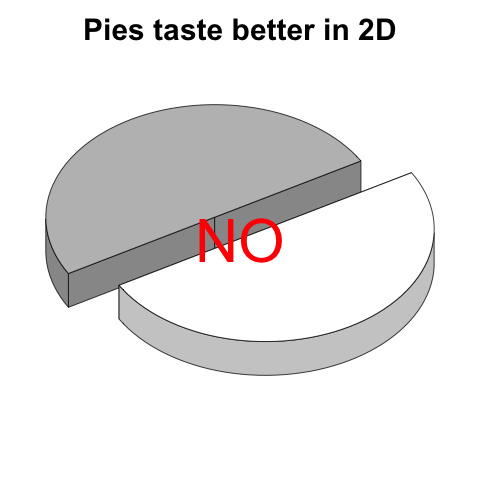
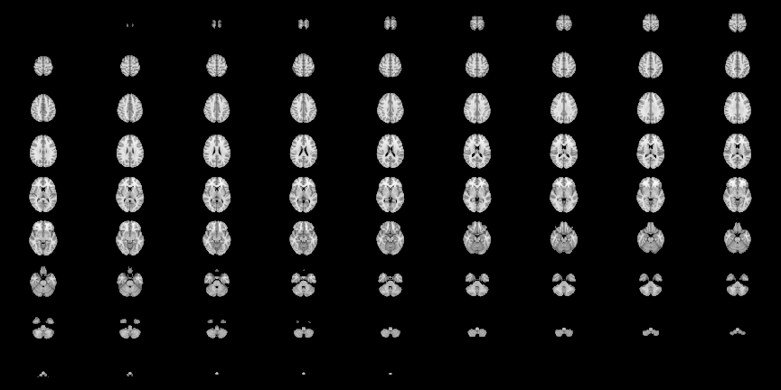

<!---
<object data="./WebGL/index.html" width="600" height="400"> <embed src="./WebGL/index.html" width="600" height="400"> </embed> Error: Embedded data could not be displayed. </object>
-->

## About Me 

* PhD student in Biostatistics at Johns Hopkins Bloomberg School of Public Health with <span class="black"><b>Ciprian Craniceanu</b></span>

* ScM 2010 (<span class="black"><b>Brian Caffo</b></span>)

* Worked in fMRI/CT for last 4 years

* Part of the <span class="black"><b>SMART group</b></span>, and ADHD-200 competition winners

* http://biostat.jhsph.edu/~jmuschel/

---

## R programs used for this presentation

* `knitr` [Xie (2013)] - compiles R code within markdown
* `slidify` [Vaidyanathan (2012)] - makes awesome slide decks (in html)
* `knitcitations` [Boettiger (2013)] - allows my BibTeX to cite in `knitr`
* `RStudio` [RStudio (2013)] - integrated R IDE

---

## 3D Graphics?


---


## I'm not referring to 3D histograms

* 3D is not good just because of one more D
* 3D data representing 2D is still bad
  * No 3D Pie charts/histograms
  * See Karl Broman's [The top ten worst graphs](http://www.biostat.wisc.edu/~kbroman/topten_worstgraphs/)


<p> </p>

---

## Overall Message

* 3D figures can be created/<span class="red"><b>exported easily</b></span>
 
* <span class="red"><b>Standalone</b></span> objects are needed for end-users/readers
 
*  <span class="red"><b>Webpages</b></span> are a good medium for these
 
* We need to figure how to effectively incorporate into pipelines/<span class="red"><b>publications</b></span>

* Focus will be on neuroimaging 

---

## Neuroimaging Data 
What kind of data do we have?
* <span class = "green">Structural MRIs</span>
* Functional MRIs
* Computed Tomography - <span class = "green">CT</span>
* Diffusion Tensor Imaging (DTI)
* Electroencephalography (EEG)
* Positron Emission Tomography (PET)
* etc. 

Visualization and presentation of these data can be <b>improved</b> with the use of 3D tools.

---


## 3D rendering tools out there

* <span class = 'green'>3D Slicer</span> - http://www.slicer.org/
* Paraview - http://www.paraview.org/
* <span class = 'green'>RGL</span> (R Graphics Library) [Adler & Murdoch, 2013] using `R` - http://cran.r-project.org/
* Freesurfer - http://surfer.nmr.mgh.harvard.edu/
* AFNI - http://afni.nimh.nih.gov/afni
* MIPAV - http://mipav.cit.nih.gov/
* Matlab, etc.

---


## Current methods of visualizing/EDA

* Time series of individual voxels/regions of interest (ROI) <b>Keep 2D</b>
* Look at data cross-sectionally ("Lightbox")


Using image.nifti from `oro.nifti`  [Whitcher _et. al._ (2011)] package:

<span class="black"><b>Read left to right like a book</b></span>

 


---

## Current methods of visualizing/EDA
Overall, most methods keep temporal or 2D spatial components fixed and vary the other. 
Using orthographic from `oro.nifti` package:

 


---

## Example of 3D in `R` 


<object data="./WebGL/index.html" width="800" height="600"> <embed src="./WebGL/index.html" width="800" height="600"> </embed> Error: Embedded data could not be displayed. </object>

---

## How do I do this in `R`? - Example


```r
### read in brain image
tmp <- readNIfTI("MNI152_T1_2mm_brain.nii", reorient = FALSE)
dtemp <- dim(tmp)
### make the surface object - RGL renders
contour3d(tmp, x = 1:dtemp[1], y = 1:dtemp[2], z = 1:dtemp[3], level = 4500, 
    alpha = 0.15)

### this would be the ``activation'' or surface you want to render here
### just taking the upper WM from the template image
contour3d(tmp, level = c(8200, 8250), alpha = c(0.5, 0.8), add = TRUE, color = c("yellow", 
    "red"))

### add text
text3d(x = dtemp[1]/2, y = dtemp[2]/2, z = dtemp[3] * 0.98, text = "Top")
text3d(x = dtemp[1] * 0.98, y = dtemp[2]/2, z = dtemp[3]/2, text = "Right")

### export this to a webpage
writeWebGL_split(dir = file.path(outdir, "webGL"), width = 700, height = 500, 
    template = file.path(outdir, "my_template.html"))
```


---

## More addons in `R`/Explanation?

* RGL - `R` adaptation of OpenGL
* Has 3d extensions of many functions: `plot3d`, `hist3d`, `text3d`, etc.
* misc3d package [ Feng & Tierney (2008) ] - add ons to this and allows for contours
* `writeWebGL` - `rgl` function that allows you to write to webGL

---


## Current methods of visualizing/EDA
* Look at data by slice over time 
  * Need to line up images so time 1 and time 2 are the same (registration) - applies to most temporal analysis

 

---


## Things Hiding in 2D
* Real Life Example:

* SubLIME is a MS lesion detection algorithm [Sweeney _et. al._ 2012].  
* MS - SUBLIME
* before 3D rendering - didn't notice misregistration

---

## What (I think) makes a good interactive neuroimaging figure


* 3-4D <b>Interactive</b> (move, zoom, remove/add surfaces)
* Easy to use
* <b>Quick</b> to render (at least on user level)
* <b>Transparency</b> (opacity) - subcortical structures
* No (or very limited) 3rd Party software
* <span class="black"><b>Exportability</b></span>
  
  (Note - current figures do not have all these qualities )

---


---

## Slicer Example - CT Data

<video width="900" height="580" controls>
  <source src="Slicer_Example.mp4" type="video/mp4" loop="true">
</video>

---

## Pros of Using Slicer

* GUI interface - can change opacity/measures interactively WSIWYG-ish
* Can make <b>exportable</b> (to html) figures
* Can incorporate into 4D - but not "out of the box" - have to add on javascript 
* Has many capabilities
* Scripting interface (I've never used) using `Python`

---


## Why use `R`?

* Why choose as the main tool? 
* <span class="black"><b>Statistics</b></span> 
* <span class="black"><b>Packages</b></span> 
* Open-source
* <b>REPRODUCIBLE</b> - somewhat lacking in neuroimaging
* <b>Scriptable</b>
* Exportable
* It works (You'll see it!)

---


  

## Where's my 4D?

* Currently 4D is not implemented in `rgl`
* Can export multiple figures and switch
  * Doesn't hold camera angle
  * Current work

---


## DTI Example 

<object data="./WebGL/index_dti.html" width="800" height="600"> <embed src="./WebGL/index_dti.html" width="800" height="600"> </embed> Error: Embedded data could not be displayed. </object>

----

 

## Why are we still 2D?

* We do exploratory data analysis / quality control mainly only in 2D

* Some investment in <span class="black>new software</span> - how many languages is enough!?

* 3D Figures in <span class="black>Papers/Presentations</span> are not generally accepted
  * "Nice picture, but where's the figure for the paper"
  
<!--- 
* Software exists to embed 3D in <span class="black"><b>PDF</b></span> - but not as smooth for large data (See Levine JGCS paper for misc3d)
-->
* "Tradition!" [Stein _et. al._ (1964)]


<span class="footnote"> Image from http://tvtropes.org/pmwiki/pmwiki.php/Theatre/FiddlerOnTheRoof?from=Main.FiddlerOnTheRoof</span>

---


## RGL Caveats
So RGL rendering is perfect, right?


---


## RGL Caveats

* Size of gzipped NIfTI file : 418Kb, unzipped 4Mb
* Size of html output : 30Mb  
* WebGL can only hold 65535 points in an object - need to break up 
  * http://biostat.jhsph.edu/~jmuschel/code/WebGL_Example.zip has example of how to do this (thanks to Duncan Murdoch)
* Also hard to see what's going on in the html

---


## Markdown - Use `R`!

* Integration into `knitr` is working - webgl hook
  * Exporting the html first, then embedding in html works fine
  * RStudio's default doesn't open md's over 2Mb (brain was 30Mb)
* `shiny` integration is possible, but slow depending on system
  * Meta-Interactive? Interactive control over interactive graphics
  
* `slidify` works with it (used in this presentation)

---

## Conclusion

* Currently - very good for internal reports/EDA
* Can integrate into new knitting tools
* Not accepted as figures in publication in
* Need journals that can handle
* You can still include standard figures in text with supplemental material
* Available methods allow for reproducibility

---


## Thanks

* Ciprian Craniceanu and Brian Caffo - SMART Group
* Elizabeth Sweeney 
* Duncan Murdoch - otherwise I'd still be presenting distorted brains

---

## Biblio
<p>Stein J, Jewison N, Topol, Crane N, Frey L, Picon M, Mann P, Morris O, Harnick S, Williams J and others (1964).
<EM>Fiddler on the Roof</EM>.
Crown.

<p>Boettiger C (2013).
<EM>knitcitations: Citations for knitr markdown files</EM>.
R package version 0.3-3, <a href="http://CRAN.R-project.org/package=knitcitations">http://CRAN.R-project.org/package=knitcitations</a>.

<p>Xie Y (2013).
<EM>knitr: A general-purpose package for dynamic report generation in
R</EM>.
R package version 1.1.4, <a href="http://yihui.name/knitr/">http://yihui.name/knitr/</a>.

<p>Feng D and Tierney L (2008).
&ldquo;Computing and Displaying Isosurfaces in R.&rdquo;
<EM>Journal of Statistical Software</EM>, <B>28</B>(1).
<a href="http://www.jstatsoft.org/v28/i01/">http://www.jstatsoft.org/v28/i01/</a>.

<p>Whitcher B, Schmid VJ and Thornton A (2011).
&ldquo;Working with the DICOM and NIfTI Data Standards in R.&rdquo;
<EM>Journal of Statistical Software</EM>, <B>44</B>(6), pp. 1&ndash;28.
<a href="http://www.jstatsoft.org/v44/i06/">http://www.jstatsoft.org/v44/i06/</a>.

<p>Adler D and Murdoch D (2013).
&ldquo;rgl: 3D visualization device system (OpenGL).&rdquo;
R package version 0.93.928, <a href="http://CRAN.R-project.org/package=rgl">http://CRAN.R-project.org/package=rgl</a>.

<p>RStudio (2013).
&ldquo;RStudio: Integrated development environment for R (Version 0.97.320).&rdquo;
[Computer software]. Retrieved March 6, 2013.
<a href="http://www.rstudio.org/">http://www.rstudio.org/</a>.

<p>Vaidyanathan R (2012).
<EM>slidify: Generate reproducible html5 slides from R markdown</EM>.
R package version 0.3.3, <a href="http://ramnathv.github.com/slidify/">http://ramnathv.github.com/slidify/</a>.

<p>Sweeney E, Shinohara R, Shea C, Reich D and Crainiceanu C (2012).
&ldquo;Automatic Lesion Incidence Estimation and Detection in Multiple Sclerosis
Using Multisequence Longitudinal MRI.&rdquo;
<EM>American Journal of Neuroradiology</EM>.

---


## Slicer
* GUI-based interface:


---

## Slicer Example 

From <a href="https://github.com/xtk/SlicerWebGLExport/blob/master/README.md">https://github.com/xtk/SlicerWebGLExport/blob/master/README.md</a>.  Shows exportability. 

(Left 3D Slicer, Right - Google Chrome)


---
