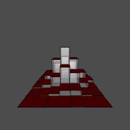
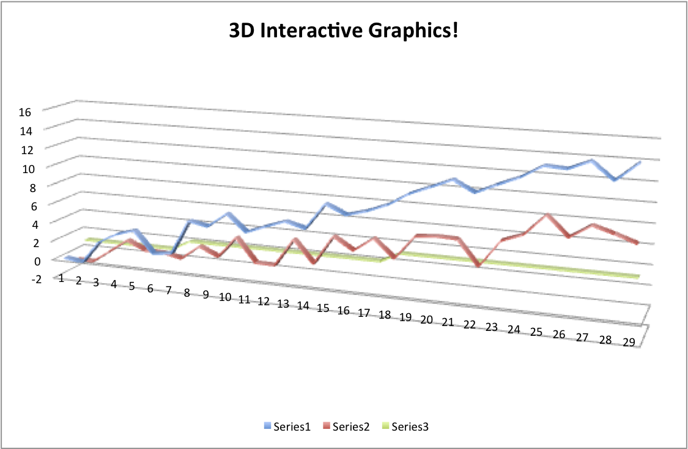

## 3D Graphics? - just because we can, doesn't mean we should
```{r hist3d, eval=FALSE, echo=FALSE }
##########
### 3D HIST EXAMPLE:
### Taken from system.file("demo", "hist3d.R", package="rgl")

binplot.3d<-function(x,y,z,alpha=1,topcol="#ff0000",sidecol="#aaaaaa")
{
  save <- par3d(skipRedraw=TRUE)
  on.exit(par3d(save))
    
  x1<-c(rep(c(x[1],x[2],x[2],x[1]),3),rep(x[1],4),rep(x[2],4))
  z1<-c(rep(0,4),rep(c(0,0,z,z),4))
  y1<-c(y[1],y[1],y[2],y[2],rep(y[1],4),rep(y[2],4),rep(c(y[1],y[2],y[2],y[1]),2))
  x2<-c(rep(c(x[1],x[1],x[2],x[2]),2),rep(c(x[1],x[2],rep(x[1],3),rep(x[2],3)),2))
  z2<-c(rep(c(0,z),4),rep(0,8),rep(z,8) )
  y2<-c(rep(y[1],4),rep(y[2],4),rep(c(rep(y[1],3),rep(y[2],3),y[1],y[2]),2) )
  rgl.quads(x1,z1,y1,col=rep(sidecol,each=4),alpha=alpha)
  rgl.quads(c(x[1],x[2],x[2],x[1]),rep(z,4),c(y[1],y[1],y[2],y[2]),
              col=rep(topcol,each=4),alpha=1) 
  rgl.lines(x2,z2,y2,col="#000000")
}

hist3d<-function(x,y=NULL,nclass="auto",alpha=1,col="#ff0000",scale=10)
  {
  save <- par3d(skipRedraw=TRUE)
  on.exit(par3d(save))
  xy <- xy.coords(x,y)
  x <- xy$x
  y <- xy$y
  n<-length(x)
  if (nclass == "auto") { nclass<-ceiling(sqrt(nclass.Sturges(x))) }
  breaks.x <- seq(min(x),max(x),length=(nclass+1))
  breaks.y <- seq(min(y),max(y),length=(nclass+1))
  z<-matrix(0,(nclass),(nclass))
  for (i in 1:nclass) 
    {
    for (j in 1:nclass) 
      {
      z[i, j] <- (1/n)*sum(x < breaks.x[i+1] & y < breaks.y[j+1] & 
                            x >= breaks.x[i] & y >= breaks.y[j])
      binplot.3d(c(breaks.x[i],breaks.x[i+1]),c(breaks.y[j],breaks.y[j+1]),
                 scale*z[i,j],alpha=alpha,topcol=col)
      }
    }
}

# Drawing a 3d histogramm of 2500 normaly distributed observations:
hist3d(rnorm(2500),rnorm(2500),alpha=0.4,nclass=7,scale=30)
filename <- file.path(outdir, "3D_Hist.png")
rgl.snapshot(filename)
rgl.close()
```





---


## Neuroimaging Data 


---


## Brain acquisition

<span class="black"><b>Read left to right like a book - down the page is down the brain</b></span>

Whole brain is acquired in "slices" - like a deli slicer.

```{r lightbox, dev='png', fig.height=6, fig.width=12, warning=FALSE, cache=TRUE, echo=FALSE}
have_info <- which(!apply(tmp, 3, function(x) any(x > 0)))
mid <- dim(tmp)[3]/2
have_info <- have_info[have_info > mid]
#image(tmp, plot.type="multiple")
### take out slices with no info
## reverse so going "up the brain"
x <- tmp[,,min(have_info):1, drop=FALSE]
image.nifti(nifti(x))
```


---


## Current methods of visualizing/EDA
Overall, most methods keep temporal or 2D spatial components fixed and vary the other. 
Using orthographic from `oro.nifti` package:

```{r ortho, dev='png', warning=FALSE, cache=TRUE}
orthographic(template, col=c(gray(0:61/64), hotmetal(3)), xyz=c(60, 85, 35), text="Example of activation map", text.cex=2)
```

---

## Moving through Space <span class="black"><b>and</b></span> Time!


---


## Example of 4D data

---


## How do we make these?

An `R` package that can create exportable `4D` scenes of surfaces:
<div align="center">
<p style="font-size:200px; text-align:center;">brainR</p>

</div>

---

## What actually goes on?

* In `R` - load the data using `oro.nifti`
* Make a contour/surface using `contour3d` from `misc3d`
* Collect surfaces in a `scene` (list of objects)
* Use `write4D` function to create `.STL` or `.OBJ` files and an html file.
* X toolkit (XTK): [https://github.com/xtk/X#readme](https://github.com/xtk/X#readme) reads and renders those files

---


## Why (I think) this makes a good interactive neuroimaging figure

* 3-4D <span class="black"><b>Interactive</b></span> (move, zoom, remove/add surfaces)
* <span class="black"><b>Transparency</b></span> (opacity) - subcortical structures
* Easy to use
* <span class="black"><b>Quick</b></span> to render (at least on user level)
* No (or very limited) 3rd Party software
* <span class="black"><b>Exportable</b></span>

---


## Thanks

* Ciprian Craniceanu and Brian Caffo - SMART Group
* Dan Hanley - MISTIE Trial
* Elizabeth Sweeney 
* Taki Shinohara

---


