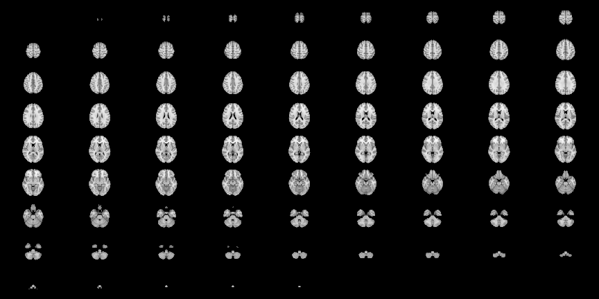
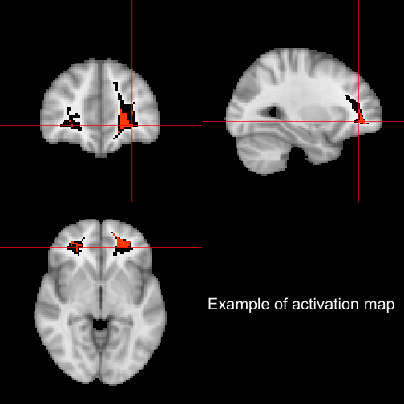

## 3D Graphics? - just because we can, doesn't mean we should


---


## Neuroimaging Data 


---


## Brain acquisition

<span class="black"><b>Read left to right like a book - down the page is down the brain</b></span>

Whole brain is acquired in "slices" - like a deli slicer.

 


---


## Current methods of visualizing/EDA
Overall, most methods keep temporal or 2D spatial components fixed and vary the other. 
Using orthographic from `oro.nifti` package:


```r
orthographic(template, col = c(gray(0:61/64), hotmetal(3)), xyz = c(60, 85, 
    35), text = "Example of activation map", text.cex = 2)
```

 


---

## Moving through Space <span class="black"><b>and</b></span> Time!


---


## Example of 4D data

---


## How do we make these?

An `R` package that can create exportable `4D` scenes of surfaces:
<div align="center">
<p style="font-size:200px; text-align:center;">brainR</p>

</div>

---

## What actually goes on?

* In `R` - load the data using `oro.nifti`
* Make a contour/surface using `contour3d` from `misc3d`
* Collect surfaces in a `scene` (list of objects)
* Use `write4D` function to create `.STL` or `.OBJ` files and an html file.
* X toolkit (XTK): [https://github.com/xtk/X#readme](https://github.com/xtk/X#readme) reads and renders those files

---


## Why (I think) this makes a good interactive neuroimaging figure

* 3-4D <span class="black"><b>Interactive</b></span> (move, zoom, remove/add surfaces)
* <span class="black"><b>Transparency</b></span> (opacity) - subcortical structures
* Easy to use
* <span class="black"><b>Quick</b></span> to render (at least on user level)
* No (or very limited) 3rd Party software
* <span class="black"><b>Exportable</b></span>

---


## Thanks

* Ciprian Craniceanu and Brian Caffo - SMART Group
* Dan Hanley - MISTIE Trial
* Elizabeth Sweeney 
* Taki Shinohara

---


