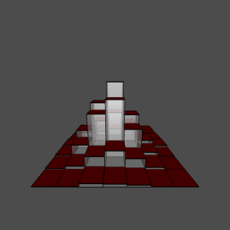

```{r opts, comment="", prompt=TRUE, echo=FALSE, message=FALSE, warning=FALSE, error=FALSE, comment=""}
library(knitr)
knit_hooks$set(webgl = hook_webgl) 
opts_chunk$set(echo=FALSE, prompt=FALSE, message=FALSE, warning=FALSE, comment="", results='hide')
```


```{r, prompt=TRUE, echo=FALSE, message=FALSE, warning=FALSE}
rm(list=ls())
library(rgl)
library(misc3d)
library(oro.dicom)
library(AnalyzeFMRI)
library(knitcitations)
library(slidify)
library(dti)
library(plotrix)
library(oro.nifti)
rootdir <- path.expand("~/Dropbox/3DPDF_Example")
outdir <- file.path(rootdir, "Presentation")
homedir <- file.path(rootdir, "Paper")
datadir <- file.path(homedir, "data")
progdir <- file.path(homedir, "programs")
resdir <- file.path(homedir, "results")
source(file.path(progdir, "asy.R"))
source(file.path(progdir, "writeWebGL_split.R"))

#### bibliography
bibfile <- file.path(homedir, "Paper_ENAR_Visualization.bib")
bib <- read.bibtex(bibfile)

setwd(outdir)
tmp <- readNIfTI(file.path(datadir, "MNI152_T1_2mm_brain.nii"), reorient=FALSE)
template <- f.read.nifti.volume(file.path(datadir, "MNI152_T1_2mm_brain.nii"))
template <- template[,,,1]
cut <- 3500
x <- which(template > cut, arr.ind=TRUE)
ctr <- as.numeric(apply(x, 2, function(col) names(which.max(table(col)))))
```


```{r testgl, echo = FALSE}
### Template from MNI152 from FSL


# dtemp <- dim(template)
# brain <- contour3d(template, x=1:dtemp[1], y=1:dtemp[2], z=1:dtemp[3], level = cut, alpha = 0.15, draw = FALSE)

# ### this would be the ``activation'' or surface you want to render 
# ### here just taking the upper WM from the template image
# activation <- contour3d(template, level = c(8200, 8250), alpha = c(0.5, 0.8), add = TRUE, color=c("yellow", "red"), draw=FALSE)

# scene <- list(brain, activation)
# drawScene.rgl(scene)
# text3d(x=dtemp[1]/2, y=dtemp[2]/2, z = dtemp[3]*0.98, text="Top")
# text3d(x=dtemp[1]*0.98, y=dtemp[2]/2, z = dtemp[3]/2, text="Right")
# ## triangle_split()
# index <- writeWebGL_split(dir=file.path(outdir, "webGL"), width=700, height=500, template= file.path(outdir, "my_template.html"))

```

<!---
<object data="./WebGL/index.html" width="600" height="400"> <embed src="./WebGL/index.html" width="600" height="400"> </embed> Error: Embedded data could not be displayed. </object>
-->

## R programs used for this presentation

* `knitr` [`r citet(bib["knitr"])`]
* `slidify` [`r citet(bib["slidify"])`]
* `knitcitations` [`r citet(bib["knitcitations"])`]
* `RStudio` [`r citet(bib["RStudio"])`]

---


## 3D Graphics?
```{r hist3d, echo=FALSE}
##########
### 3D HIST EXAMPLE:
### Taken from system.file("demo", "hist3d.R", package="rgl")

binplot.3d<-function(x,y,z,alpha=1,topcol="#ff0000",sidecol="#aaaaaa")
{
  save <- par3d(skipRedraw=TRUE)
  on.exit(par3d(save))
    
  x1<-c(rep(c(x[1],x[2],x[2],x[1]),3),rep(x[1],4),rep(x[2],4))
  z1<-c(rep(0,4),rep(c(0,0,z,z),4))
  y1<-c(y[1],y[1],y[2],y[2],rep(y[1],4),rep(y[2],4),rep(c(y[1],y[2],y[2],y[1]),2))
  x2<-c(rep(c(x[1],x[1],x[2],x[2]),2),rep(c(x[1],x[2],rep(x[1],3),rep(x[2],3)),2))
  z2<-c(rep(c(0,z),4),rep(0,8),rep(z,8) )
  y2<-c(rep(y[1],4),rep(y[2],4),rep(c(rep(y[1],3),rep(y[2],3),y[1],y[2]),2) )
  rgl.quads(x1,z1,y1,col=rep(sidecol,each=4),alpha=alpha)
  rgl.quads(c(x[1],x[2],x[2],x[1]),rep(z,4),c(y[1],y[1],y[2],y[2]),
              col=rep(topcol,each=4),alpha=1) 
  rgl.lines(x2,z2,y2,col="#000000")
}

hist3d<-function(x,y=NULL,nclass="auto",alpha=1,col="#ff0000",scale=10)
  {
  save <- par3d(skipRedraw=TRUE)
  on.exit(par3d(save))
  xy <- xy.coords(x,y)
  x <- xy$x
  y <- xy$y
  n<-length(x)
  if (nclass == "auto") { nclass<-ceiling(sqrt(nclass.Sturges(x))) }
  breaks.x <- seq(min(x),max(x),length=(nclass+1))
  breaks.y <- seq(min(y),max(y),length=(nclass+1))
  z<-matrix(0,(nclass),(nclass))
  for (i in 1:nclass) 
    {
    for (j in 1:nclass) 
      {
      z[i, j] <- (1/n)*sum(x < breaks.x[i+1] & y < breaks.y[j+1] & 
                            x >= breaks.x[i] & y >= breaks.y[j])
      binplot.3d(c(breaks.x[i],breaks.x[i+1]),c(breaks.y[j],breaks.y[j+1]),
                 scale*z[i,j],alpha=alpha,topcol=col)
      }
    }
}

# Drawing a 3d histogramm of 2500 normaly distributed observations:
hist3d(rnorm(2500),rnorm(2500),alpha=0.4,nclass=7,scale=30)
filename <- file.path(outdir, "3D_Hist.png")
rgl.snapshot(filename)
rgl.close()
```




---


## I'm not referring to 3D histograms

* 3D is not good just because of one more D
* 3D data representing 2D is still bad
  * No 3D Pie charts/histograms
  * See Karl Broman's [The top ten worst graphs](http://www.biostat.wisc.edu/~kbroman/topten_worstgraphs/)

```{r piechart, echo=FALSE, message=FALSE, warning=FALSE, results='hide', eval=FALSE}
png("figure/piechart.png")
slices <- c(50, 50) 
lbls <- paste0("group", 1:length(slices) )
pie3D(slices,explode=0.3, theta = pi/3, start=pi/6, col=c("gray", "white", border="green"), main="Pies taste better in 2D", cex.main=2.5)
text(0, 0, "NO", cex=5, col="red")
dev.off()
```
<p> </p>

---

## Overall Message

* 3D figures can be created/<span class="red"<b>exported easily</b></span>
 
* <span class="red"><b>Standalone</b></span> objects are needed for end-users/readers
 
*  <span class="red"><b>Webpages</b></span> are a good medium for these
 
* We need to figure how to effectively incorporate into pipelines/<span class="red"><b>publications</b></span>

---

## Neuroimaging Data 
What kind of data do we have?
* <span class = "green">Structural MRIs</span>
* Functional MRIs
* <span class = "green">CT</span>
* DTI
* EEG
* PET
* etc. 

Visualization and presentation of these data can be <b>improved</b> with the use of 3D tools.

---


## 3D rendering tools out there

* <span class = 'green'>3D Slicer</span> - http://www.slicer.org/
* Paraview - http://www.paraview.org/
* <span class = 'green'>RGL</span> [`r citep(bib["rgl"])`] using `R` - http://cran.r-project.org/
* Freesurfer - http://surfer.nmr.mgh.harvard.edu/
* AFNI - http://afni.nimh.nih.gov/afni
* MIPAV - http://mipav.cit.nih.gov/
* Matlab, etc.

---


## Current methods of visualizing/EDA

* Time series of individual voxels/regions of interest (ROI) <b>Keep 2D</b>
* Look at data cross-sectionally ("Lightbox" - read left to right like a book, down means higher slices in the brain)


Using image.nifti from `oro.nifti`  [`r citet(bib["oro.nifti"])`] package:

```{r lightbox, dev='png', fig.height=5, fig.width=10, warning=FALSE, echo = FALSE, cache=TRUE}
have_info <- which(!apply(tmp, 3, function(x) any(x > 0)))
mid <- dim(tmp)[3]/2
have_info <- have_info[have_info > mid]
#image(tmp, plot.type="multiple")
x <- tmp[,,1:min(have_info), drop=FALSE]
image.nifti(nifti(x))
```

---

## Current methods of visualizing/EDA
* Look at data by slice over time 
  * Need to line up images so time 1 and time 2 are the same (registration) - applies to most temporal analysis

```{r lightbox2, echo = FALSE, dev='png', fig.height=5, fig.width=10, warning=FALSE, cache=TRUE}
slice95 <- readNIfTI(file.path(datadir, "Slice95.nii.gz"), reorient=FALSE)
image.nifti(slice95)
```
---

## Current methods of visualizing/EDA
Overall, most methods keep temporal or 2D spatial components fixed and vary the other. 
Using orthographic from `oro.nifti` package:

```{r ortho, echo = FALSE, dev='png', warning=FALSE, cache=TRUE}
orthographic(template, col=c(gray(0:61/64), hotmetal(3)), xyz=c(60, 85, 35), text="Example of activation map", text.cex=2)
```

---

## Why are we still 2D?

* We do EDA/QC mainly only in 2D

* Some investment in new software - how many languages is enough!?

* 3D Figures in Papers/Presentations are not generally accepted
  * "Nice picture, but where's the figure for the paper"
  
* Software exists to embed 3D in <span class="black"><b>PDF</b></span> - but not as smooth for large data (See Levine JGCS paper for misc3d)

* "Tradition!" [`r citet(bib["fiddler"])`]

---


## What (I think) makes a good interactive neuroimaging figure


* 3-4D <b>Interactive</b> (move, zoom, remove/add surfaces)
* Easy to use
* <b>Quick</b> to render (at least on user level)
* <b>Transparency</b> (opacity) - subcortical structures
* No (or very limited) 3rd Party software
* <span class="black"><b>Exportability</b></span>
  
  (Note - current figures do not have all these qualities )

---


## 3D Slicer

* Comes out of Bringham and Women's Hospital/Harvard Group 
  * User community also makes functions (modules in `Slicer`)
* `3D Slicer` is a processing, analysis, and rendering tool
* Can read in almost all imaging types
* Very visual interface:

---

## Slicer Example - CT Data

From <a href="https://github.com/xtk/SlicerWebGLExport/blob/master/README.md">https://github.com/xtk/SlicerWebGLExport/blob/master/README.md</a>


---

## Slicer Example - CT Data
Motivating Example:

Thumbnails of clearance from Natalie

---

## Slicer Example - CT Data

<video width="900" height="580" controls>
  <source src="Slicer_Example.mp4" type="video/mp4" loop="true">
</video>

---

## Pros of Using Slicer

* GUI interface - can change opacity/measures interactively WSIWYG-ish
* Can make <b>exportable</b> (to html) figures
* Can incorporate into 4D - but not "out of the box" - have to add on javascript 
* Has many capabilities
* Scripting interface (I've never used) using `Python`

---


## Why use `R`?

* Why choose as the main tool? 
* <span class="black"><b>Statistics</b></span> 
* <span class="black"><b>Packages</b></span> 
* Open-source
* <b>REPRODUCIBLE</b> - somewhat lacking in neuroimaging
* <b>Scriptable</b>
* Exportable
* It works (You'll see it!)

---


## Example of 3D in `R` 


<object data="./WebGL/index.html" width="800" height="600"> <embed src="./WebGL/index.html" width="800" height="600"> </embed> Error: Embedded data could not be displayed. </object>

---

## How do I do this in `R`?

* RGL - `R` adaptation of OpenGL
* Has 3d extensions of many functions: `plot3d`, `hist3d`, `text3d`, etc.
* misc3d package [`{r citet(bib["misc3d"])}`] - add ons to this and allows for contours
* `writeWebGL` - `rgl` function that allows you to write to webGL

---

## How do I do this in `R`? - Example

```{r ex_code, eval=FALSE, echo=TRUE}
tmp <- readNIfTI(file.path(datadir, "MNI152_T1_2mm_brain.nii"), reorient=FALSE)

contour3d(template, x=1:dim(temp)[1], y=1:dim(temp)[2], z=1:dim(temp)[3], level = 3500, alpha = 0.15)

writeWebGL_split(dir=file.path(outdir, "webGL"), width=700, height=500, template= file.path(outdir, "my_template.html"))
```

---
  

## Where's my 4D?

* Currently 4D is not implemented in `rgl`
* Can export multiple figures and switch
  * Doesn't hold camera angle
  * Current work

---


```{r dti-example, cache=FALSE, echo = FALSE}
# path2cibc <- file.path(outdir, "brain-dt/")
# 
# # read function for NRRD-files
# read.nrrd <- function(file,path=file.path(outdir, "brain-dt/")){
#   if(!file.exists(file)&&!file.exists(paste(path,file,sep=""))) {
#   cat("Please first download the data set from the CIBC Datasets Archive \n\n",
#       "http://www.sci.utah.edu/releases/scirun_v4.1/SCIRunData_4.1_20090629_data.tgz\n\n",
#       "which is part of the SCIRun software version (4.1)\n",
#       "and unpack it into your current directory or provide a path to the data in 
#        path2cibc \n\n")
#   cat("Note the mandatory acknowledgment if this dataset is used in any 
#        publication or third-party work, see:\n
#        http://www.sci.utah.edu/cibc/software/114-cibcdata.html \n\n")
#        stop("Stopping")
#   } 
#   if(!file.exists(file)) file <- paste(path,file,sep="")
#   con <- file(file,"r")
#   filetype <- readLines(con,n=1)
#   count <- 1
#   notempty <- TRUE
#   while (notempty) {
#      zzz <- readLines(con,n=1) 
#      if (nchar(zzz)==0) {
#         notempty <- FALSE
#         count <- count+1
#      } else {
#         zzz <- strsplit(zzz,": ")
#         what <- zzz[[1]][1]
#         if (what=="type") type<-switch(zzz[[1]][2],float="numeric",integer="integer","integer")
#         if (what=="dimension") dimension <- as.numeric(zzz[[1]][2])
#         if (what=="sizes") sizes <- as.numeric(unlist(strsplit(zzz[[1]][2]," ")))
#         if (what=="spacings") vextension <- as.numeric(unlist(strsplit(zzz[[1]][2]," ")))
#         if (what=="endian") endian <- zzz[[1]][2]
#         if (what=="encoding") encoding <- zzz[[1]][2]
#         count <- count+1
#      }
#   }
#   close(con)
#   if(encoding=="raw"){
#     con <- file(file,"rb")
#     ttt <- readLines(con,n=count) # header again
#     img <- readBin(con,type,n=prod(sizes),switch(type,numeric=4,integer=2),signed=FALSE,endian=endian)
#     close(con)
#   }
#   invisible(array(img,sizes))
# }
# 
# # read the data and create a prepared tmpfile, 
# # corresponds to "self-prepared" binary image file
# # see page 12 of manuscript
# s0 <- read.nrrd("gkwi-1.5mm-B0.nrrd",path=path2cibc)
# if(any(is.nan(s0))) stop("Please use the data from \n http://www.sci.utah.edu/releases/scirun_v4.1/SCIRunData_4.1_20090629_data.tgz \n")
# 
# ddim <- dim(s0)
# si <- read.nrrd("gkwi-1.5mm-DWI.nrrd",path=path2cibc)
# si <- aperm(si,c(2:4,1))
# file <- "demo-gradients.txt"
# if(!file.exists(file)) file <- paste(path2cibc,"demo-gradients.txt",sep="")
# if(!file.exists(file)) stop("need file SCIRunData_4.1_20090629_data/brain-dt/demo-gradients.txt from  SCIRunData ")
# grad <- rbind(c(0,0,0),read.table(file))
# cat("Use of this data set was made possible in part by software from the \n NIH/NCRR Center for Integrative Biomedical Computing, P41-RR12553-10.\n")
# s0[s0<0] <- 0
# si[si<0] <- 0
# s0[is.na(s0)] <- 0
# si[is.na(si)] <- 0
# rangesi <- range(s0,si)
# si <- c(as.integer(32000*s0/rangesi[2]),as.integer(32000*si/rangesi[2]))
# dim(si) <- c(ddim,dim(grad)[1])
# tmpfile <- tempfile("gkwi-1.5")
# con <- file(tmpfile,"wb")
# writeBin(as.integer(si),con,2)
# close(con)
# rm(s0,rangesi,si,read.nrrd)
# gc()
# 
# # start the analysis
# data <- dtiData(grad,tmpfile,ddim,maxvalue=32000)
# data <- sdpar(data,interactive=FALSE,level=1300)
# # # set to 1300, if you want to produce figure 2, run with TRUE
# # sdgraph <- FALSE
# # if (sdgraph) {
#   # pdf("figure2.pdf",width=8,height=4)
#   # par(mar=c(3,3,3,1),mgp=c(2,1,0))
#   # data <- sdpar(data,interactive=TRUE,level=1300)
#   # Y
#   # dev.off()
# # }
# 
# # create diffusion tensor estimates
# tensor <- dtiTensor(data)
# 
# # create anisotropy indices
# dtind <- dtiIndices(tensor)
# 
# show3d(dtind)
# index <- writeWebGL_split(dir=file.path(outdir, "webGL"), filename = file.path(outdir, "webGL", "index_dti.html"), width=700, height=500, template= file.path(outdir, "my_template.html"))

```

## DTI Example 

<object data="./WebGL/index_dti.html" width="800" height="600"> <embed src="./WebGL/index_dti.html" width="800" height="600"> </embed> Error: Embedded data could not be displayed. </object>

----

## Why use this for Exploratory Data Analysis (EDA)/ Quality Checking (QC)

* Respects true nature of data (brains are not slices!)
* Can get more of an overview
* Motion - can look and interact to see if there are problems
* Some things become more apparent in 3D

---     


## Things Hiding in 2D
* Real Life Example:

* SubLIME is a MS lesion detection algorithm [`r citep(bib["sublime"])`].  
* MS - SUBLIME
* before 3D rendering - didn't notice misregistration

---

## RGL Caveats
So RGL rendering is perfect, right?


---


## RGL Caveats

* Size of gzipped NIfTI file : 418Kb, unzipped 4Mb
* Size of html output : 30Mb  
* WebGL can only hold 65535 points in an object - need to break up 
  * http://biostat.jhsph.edu/~jmuschel/code/WebGL_Example.zip has example of how to do this (thanks to Duncan Murdoch)
* Also hard to see what's going on in the html

---


## Markdown - Use `R`!

* Integration into `knitr` is working - webgl hook
  * Exporting the html first, then embedding in html works fine
  * RStudio's default doesn't open md's over 2Mb (brain was 30Mb)
* `shiny` integration is possible, but slow depending on system
  * Meta-Interactive? Interactive control over interactive graphics
  
* `slidify` works with it (used in this presentation)

---

## Conclusion

* Currently - very good for internal reports/EDA
* Can integrate into new knitting tools
* Not accepted as figures in publication in
* Need journals that can handle
* You can still include standard figures in text with supplemental material
* Available methods allow for reproducibility

---


## Thanks

* Ciprian Craniceanu and Brian Caffo - SMART Group
* Elizabeth Sweeney 
* Duncan Murdoch - otherwise I'd still be presenting distorted brains

---

## Biblio
```{r biblio, results='asis', eval=FALSE, echo = FALSE}
bibliography("html") 
```
---

## WHhat

Here are the steps.
Need a structure
4D - over time or multiple ROIs

---


## Slide 1

Functional brain imaging (e.g. fMRI, PET, EEG) data is a 4-dimensional time series representing changes in brain activity over time.  

Structrual imaging (e.g. MPRAGE, DTI, CT) also has been increasingly more common to have a longitudinal component, where participants/subjects are scanned multiple times. 

Visualization and presentation of these data can be improved with the use of 3D tools.


NEEDED: pictures of brains - a lot - DTI ex, MRI
