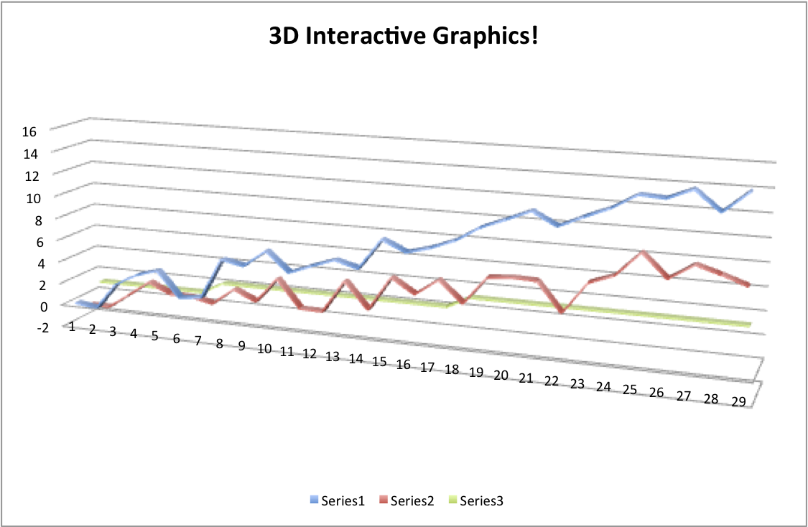

<!---
<object data="./WebGL/index.html" width="600" height="400"> <embed src="./WebGL/index.html" width="600" height="400"> </embed> Error: Embedded data could not be displayed. </object>
-->

## R programs used for this presentation

* `knitr` [Xie (2013)]
* `slidify` [Vaidyanathan (2012)]
* `knitcitations` [Boettiger (2013)]
* `RStudio` [RStudio (2013)]

---


## 3D Graphics?




---


## I'm not referring to 3D histograms

* 3D is not good just because of one more D
* 3D data representing 2D is still bad
  * No 3D Pie charts/histograms
  * See Karl Broman's [The top ten worst graphs](http://www.biostat.wisc.edu/~kbroman/topten_worstgraphs/)


<p> </p>

---

## Overall Message

* 3D figures can be created/<span class="red"<b>exported easily</b></span>
 
* <span class="red"><b>Standalone</b></span> objects are needed for end-users/readers
 
*  <span class="red"><b>Webpages</b></span> are a good medium for these
 
* We need to figure how to effectively incorporate into pipelines/<span class="red"><b>publications</b></span>

---

## Neuroimaging Data 
What kind of data do we have?
* <span class = "green">Structural MRIs</span>
* Functional MRIs
* <span class = "green">CT</span>
* DTI
* EEG
* PET
* etc. 

Visualization and presentation of these data can be <b>improved</b> with the use of 3D tools.

---


## 3D rendering tools out there

* <span class = 'green'>3D Slicer</span> - http://www.slicer.org/
* Paraview - http://www.paraview.org/
* <span class = 'green'>RGL</span> [(Adler and Murdoch, 2013)] using `R` - http://cran.r-project.org/
* Freesurfer - http://surfer.nmr.mgh.harvard.edu/
* AFNI - http://afni.nimh.nih.gov/afni
* MIPAV - http://mipav.cit.nih.gov/
* Matlab, etc.

---


## Current methods of visualizing/EDA

* Time series of individual voxels/regions of interest (ROI) <b>Keep 2D</b>
* Look at data cross-sectionally ("Lightbox" - read left to right like a book, down means higher slices in the brain)


Using image.nifti from `oro.nifti`  [Whitcher, Schmid, and Thornton (2011)] package:

 

---

## Current methods of visualizing/EDA
* Look at data by slice over time 
  * Need to line up images so time 1 and time 2 are the same (registration) - applies to most temporal analysis

 
---

## Current methods of visualizing/EDA
Overall, most methods keep temporal or 2D spatial components fixed and vary the other. 
Using orthographic from `oro.nifti` package:

 

---

## Why are we still 2D?

* We do EDA/QC mainly only in 2D

* Some investment in new software - how many languages is enough!?

* 3D Figures in Papers/Presentations are not generally accepted
  * "Nice picture, but where's the figure for the paper"
  
* Software exists to embed 3D in <span class="black"><b>PDF</b></span> - but not as smooth for large data (See Levine JGCS paper for misc3d)

* "Tradition!" [Stein, Jewison, Topol, et al. (1964)]

---


## What (I think) makes a good interactive neuroimaging figure


* 3-4D <b>Interactive</b> (move, zoom, remove/add surfaces)
* Easy to use
* <b>Quick</b> to render (at least on user level)
* <b>Transparency</b> (opacity) - subcortical structures
* No (or very limited) 3rd Party software
* <span class="black"><b>Exportability</b></span>
  
  (Note - current figures do not have all these qualities )

---


## 3D Slicer

* Comes out of Bringham and Women's Hospital/Harvard Group 
  * User community also makes functions (modules in `Slicer`)
* `3D Slicer` is a processing, analysis, and rendering tool
* Can read in almost all imaging types
* Very visual interface:

---

## Slicer Example - CT Data

From <a href="https://github.com/xtk/SlicerWebGLExport/blob/master/README.md">https://github.com/xtk/SlicerWebGLExport/blob/master/README.md</a>


---

## Slicer Example - CT Data
Motivating Example:

Thumbnails of clearance from Natalie

---

## Slicer Example - CT Data

<video width="900" height="580" controls>
  <source src="Slicer_Example.mp4" type="video/mp4" loop="true">
</video>

---

## Pros of Using Slicer

* GUI interface - can change opacity/measures interactively WSIWYG-ish
* Can make <b>exportable</b> (to html) figures
* Can incorporate into 4D - but not "out of the box" - have to add on javascript 
* Has many capabilities
* Scripting interface (I've never used) using `Python`

---


## Why use `R`?

* Why choose as the main tool? 
* <span class="black"><b>Statistics</b></span> 
* <span class="black"><b>Packages</b></span> 
* Open-source
* <b>REPRODUCIBLE</b> - somewhat lacking in neuroimaging
* <b>Scriptable</b>
* Exportable
* It works (You'll see it!)

---


## Example of 3D in `R` 


<object data="./WebGL/index.html" width="800" height="600"> <embed src="./WebGL/index.html" width="800" height="600"> </embed> Error: Embedded data could not be displayed. </object>

---

## How do I do this in `R`?

* RGL - `R` adaptation of OpenGL
* Has 3d extensions of many functions: `plot3d`, `hist3d`, `text3d`, etc.
* misc3d package [`{r citet(bib["misc3d"])}`] - add ons to this and allows for contours
* `writeWebGL` - `rgl` function that allows you to write to webGL

---

## How do I do this in `R`? - Example


```r
tmp <- readNIfTI(file.path(datadir, "MNI152_T1_2mm_brain.nii"), reorient=FALSE)

contour3d(template, x=1:dim(temp)[1], y=1:dim(temp)[2], z=1:dim(temp)[3], level = 3500, alpha = 0.15)

writeWebGL_split(dir=file.path(outdir, "webGL"), width=700, height=500, template= file.path(outdir, "my_template.html"))
```

---
  

## Where's my 4D?

* Currently 4D is not implemented in `rgl`
* Can export multiple figures and switch
  * Doesn't hold camera angle
  * Current work

---


## DTI Example 

<object data="./WebGL/index_dti.html" width="800" height="600"> <embed src="./WebGL/index_dti.html" width="800" height="600"> </embed> Error: Embedded data could not be displayed. </object>

----

## Why use this for Exploratory Data Analysis (EDA)/ Quality Checking (QC)

* Respects true nature of data (brains are not slices!)
* Can get more of an overview
* Motion - can look and interact to see if there are problems
* Some things become more apparent in 3D

---     


## Things Hiding in 2D
* Real Life Example:

* SubLIME is a MS lesion detection algorithm [(Sweeney, Shinohara, Shea, et al., 2012)].  
* MS - SUBLIME
* before 3D rendering - didn't notice misregistration

---

## RGL Caveats
So RGL rendering is perfect, right?


---


## RGL Caveats

* Size of gzipped NIfTI file : 418Kb, unzipped 4Mb
* Size of html output : 30Mb  
* WebGL can only hold 65535 points in an object - need to break up 
  * http://biostat.jhsph.edu/~jmuschel/code/WebGL_Example.zip has example of how to do this (thanks to Duncan Murdoch)
* Also hard to see what's going on in the html

---


## Markdown - Use `R`!

* Integration into `knitr` is working - webgl hook
  * Exporting the html first, then embedding in html works fine
  * RStudio's default doesn't open md's over 2Mb (brain was 30Mb)
* `shiny` integration is possible, but slow depending on system
  * Meta-Interactive? Interactive control over interactive graphics
  
* `slidify` works with it (used in this presentation)

---

## Conclusion

* Currently - very good for internal reports/EDA
* Can integrate into new knitting tools
* Not accepted as figures in publication in
* Need journals that can handle
* You can still include standard figures in text with supplemental material
* Available methods allow for reproducibility

---


## Thanks

* Ciprian Craniceanu and Brian Caffo - SMART Group
* Elizabeth Sweeney 
* Duncan Murdoch - otherwise I'd still be presenting distorted brains

---

## Biblio

---

## WHhat

Here are the steps.
Need a structure
4D - over time or multiple ROIs

---


## Slide 1

Functional brain imaging (e.g. fMRI, PET, EEG) data is a 4-dimensional time series representing changes in brain activity over time.  

Structrual imaging (e.g. MPRAGE, DTI, CT) also has been increasingly more common to have a longitudinal component, where participants/subjects are scanned multiple times. 

Visualization and presentation of these data can be improved with the use of 3D tools.


NEEDED: pictures of brains - a lot - DTI ex, MRI
