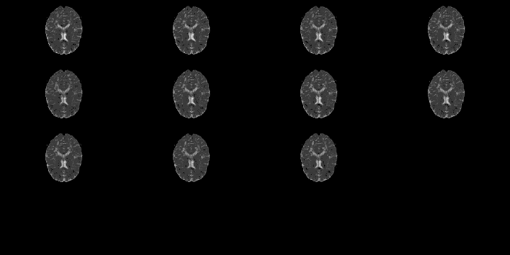

## Slicer
* GUI-based interface:

---

## Slicer Example 

From <a href="https://github.com/xtk/SlicerWebGLExport/blob/master/README.md">https://github.com/xtk/SlicerWebGLExport/blob/master/README.md</a>.  Shows exportability. 

(Left 3D Slicer, Right - Google Chrome)

---

## Pros of Using Slicer

* GUI interface - can change opacity/measures interactively WSIWYG-ish
* Can make <b>exportable</b> (to html) figures
* Can incorporate into 4D - but not "out of the box" - have to add on javascript 
* Has many capabilities
* Scripting interface (I've never used) using `Python`

---

## More addons in `R`/Explanation?

* RGL - `R` adaptation of OpenGL
* Has 3d extensions of many functions: `plot3d`, `hist3d`, `text3d`, etc.
* misc3d package [ Feng & Tierney (2008) ] - add ons to this and allows for contours
* `writeWebGL` - `rgl` function that allows you to write to webGL

---

## Things Hiding in 2D
* Real Life Example:

* SubLIME is a MS lesion detection algorithm [Sweeney _et. al._ 2012].  
* MS - SUBLIME
* before 3D rendering - didn't notice misregistration

---

## Moving through Space <b>and</b> Time!
* Look at data by slice over time 
  * Need to line up images so time 1 and time 2 are the same (registration) - applies to most temporal analysis

 

---

## RGL Caveats
So RGL rendering is perfect, right?

---

## RGL Caveats

* Size of gzipped NIfTI file : 418Kb, unzipped 4Mb
* Size of html output : 30Mb  
* WebGL can only hold 65535 points in an object - need to break up 
  * http://biostat.jhsph.edu/~jmuschel/code/WebGL_Example.zip has example of how to do this (thanks to Duncan Murdoch)
* Also hard to see what's going on in the html

---

## DTI Example 

<object data="./WebGL/index_dti.html" width="800" height="600"> <embed src="./WebGL/index_dti.html" width="800" height="600"> </embed> Error: Embedded data could not be displayed. </object>

----
