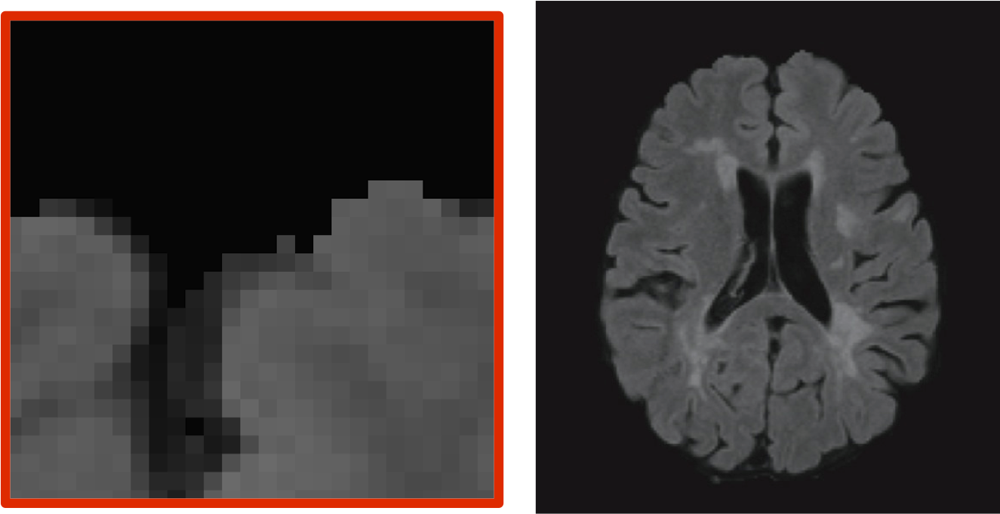

## MISTIE and CLEAR Trials

* Intraventricular Hemorrhage (IVH) and Intracerebral Hemorrhage (ICH), and generally hypertensive bleeds

* CLEAR (IVH)- Clot Lysis: Evaluating Accelerated Resolution of Hemorrhage with rt-PA (Phase III - began Sept 2009)
    * 500 patients total
    * Placebo/Control
* MISTIE (ICH) - Minimally Invasive Surgery + rt-PA for Intracerebral Hemorrhage (Phase II - just completed)
    * 123 randomized patients: 60 surgical, 63 control (medical management)

---


## MISTIE and CLEAR Data

* Serial CT imaging to show clot clearance
* 5-12 per person
* (as a reference - many stroke trials get 1-2)
* Previous studies have shown that clot volume and clot location (at least for IVH) is indicative of good functional outcome
* Good functional - outcome (modified Rankin Score)

---

## Hey

<table border=1>
<CAPTION ALIGN="bottom"> Logistic regression for 180-day Modified Rankin outcome scores (mRS).  Models are presented with odds ratio of mRS < 4 and confidence intervals as: LB;OR UB;, where OR is the odds ratio, and LB/UB are the upper/lower bounds of the 95% confidence interval, respectively.  Both MIS and higher clot resolution increase the odds of a good functional outcome (mRS < 4), after adjusting for initial severity factors. </CAPTION>
  <TR> <TD> GCS at Enrollment </TD> <TD align="center">  1.34;1.75; 2.29 </TD> <TD align="center"> < 0.0001 </TD> <TD align="center">  1.36;1.81; 2.40 </TD> <TD align="center"> < 0.0001 </TD> </TR>
   <TR> <TD> Age at Enrollment </TD> <TD align="center">  0.86; 0.92; 0.97 </TD> <TD align="center"> 0.004 </TD> <TD align="center">  0.85; 0.91; 0.97 </TD> <TD align="center"> 0.003 </TD> </TR>
   <TR> <TD> Pre-Randomization ICH Volume (per 10cc) </TD> <TD align="center">  0.64; 0.90; 1.25 </TD> <TD align="center"> 0.514 </TD> <TD align="center">  0.40; 0.64; 1.01 </TD> <TD align="center"> 0.056 </TD> </TR>
   <TR> <TD> MIS vs. Medical </TD> <TD align="center">  0.75; 2.63; 9.30 </TD> <TD align="center"> 0.133 </TD> <TD align="center">  </TD> <TD align="center">  </TD> </TR>
   <TR> <TD> Resolved ICH Volume (per 10cc) </TD> <TD align="center">  </TD> <TD align="center">  </TD> <TD align="center">  1.12; 1.84; 3.03 </TD> <TD align="center"> 0.017 </TD> </TR>
</table>


---


## Moving through Space <span class="black"><b>and</b></span> Time!


---

## Slicer Example - WebGL export - CT Data

<video width="900" height="580" controls>
  <source src="Slicer_Example.mp4" type="video/mp4" loop="true">
</video>

---

## Neuroimaging Data 




---

## Overview 

* CLEAR and MISTIE Trials
* <strong>Visualizing imaging data better</strong>
* Novel methods for CT Data

---


## Current methods of visualizing/EDA
* "Lightbox" - using image.nifti from `oro.nifti`  [`r citet(bib["oro.nifti"])`] package:

<span class="black"><b>Read left to right like a book - down the page is down the brain</b></span>

```{r lightbox, dev='png', fig.height=6, fig.width=12, warning=FALSE, cache=TRUE}
have_info <- which(!apply(tmp, 3, function(x) any(x > 0)))
mid <- dim(tmp)[3]/2
have_info <- have_info[have_info > mid]
#image(tmp, plot.type="multiple")
### take out slices with no info
## reverse so going "up the brain"
x <- tmp[,,min(have_info):1, drop=FALSE]
image.nifti(nifti(x))
```
<!---
* Time series of individual voxels/regions of interest (ROI) <span class="black"><b>Keep 2D</b></span>
-->

---

## Current methods of visualizing/EDA
Overall, most methods keep temporal or 2D spatial components fixed and vary the other. 
Using orthographic from `oro.nifti` package:

```{r ortho, dev='png', warning=FALSE, cache=TRUE}
orthographic(template, col=c(gray(0:61/64), hotmetal(3)), xyz=c(60, 85, 35), text="Example of activation map", text.cex=2)
```

---

## Example of 3D in `R` 


<iframe width="1200" height="800" src="./WebGL/index_jsed.html" style="-webkit-transform:scale(1);-moz-transform-scale(1);"></iframe>


---


## What (I think) makes a good interactive neuroimaging figure


* 3-4D <span class="black"><b>Interactive</b></span> (move, zoom, remove/add surfaces)
* <span class="black"><b>Transparency</b></span> (opacity) - subcortical structures
* Easy to use
* <span class="black"><b>Quick</b></span> to render (at least on user level)
* No (or very limited) 3rd Party software
* <span class="black"><b>Exportable</b></span>
  
  (Note - current figures do not have all these qualities )

---


```{r dti-example, cache=FALSE}
# path2cibc <- file.path(outdir, "brain-dt/")
# 
# # read function for NRRD-files
# read.nrrd <- function(file,path=file.path(outdir, "brain-dt/")){
#   if(!file.exists(file)&&!file.exists(paste(path,file,sep=""))) {
#   cat("Please first download the data set from the CIBC Datasets Archive \n\n",
#       "http://www.sci.utah.edu/releases/scirun_v4.1/SCIRunData_4.1_20090629_data.tgz\n\n",
#       "which is part of the SCIRun software version (4.1)\n",
#       "and unpack it into your current directory or provide a path to the data in 
#        path2cibc \n\n")
#   cat("Note the mandatory acknowledgment if this dataset is used in any 
#        publication or third-party work, see:\n
#        http://www.sci.utah.edu/cibc/software/114-cibcdata.html \n\n")
#        stop("Stopping")
#   } 
#   if(!file.exists(file)) file <- paste(path,file,sep="")
#   con <- file(file,"r")
#   filetype <- readLines(con,n=1)
#   count <- 1
#   notempty <- TRUE
#   while (notempty) {
#      zzz <- readLines(con,n=1) 
#      if (nchar(zzz)==0) {
#         notempty <- FALSE
#         count <- count+1
#      } else {
#         zzz <- strsplit(zzz,": ")
#         what <- zzz[[1]][1]
#         if (what=="type") type<-switch(zzz[[1]][2],float="numeric",integer="integer","integer")
#         if (what=="dimension") dimension <- as.numeric(zzz[[1]][2])
#         if (what=="sizes") sizes <- as.numeric(unlist(strsplit(zzz[[1]][2]," ")))
#         if (what=="spacings") vextension <- as.numeric(unlist(strsplit(zzz[[1]][2]," ")))
#         if (what=="endian") endian <- zzz[[1]][2]
#         if (what=="encoding") encoding <- zzz[[1]][2]
#         count <- count+1
#      }
#   }
#   close(con)
#   if(encoding=="raw"){
#     con <- file(file,"rb")
#     ttt <- readLines(con,n=count) # header again
#     img <- readBin(con,type,n=prod(sizes),switch(type,numeric=4,integer=2),signed=FALSE,endian=endian)
#     close(con)
#   }
#   invisible(array(img,sizes))
# }
# 
# # read the data and create a prepared tmpfile, 
# # corresponds to "self-prepared" binary image file
# # see page 12 of manuscript
# s0 <- read.nrrd("gkwi-1.5mm-B0.nrrd",path=path2cibc)
# if(any(is.nan(s0))) stop("Please use the data from \n http://www.sci.utah.edu/releases/scirun_v4.1/SCIRunData_4.1_20090629_data.tgz \n")
# 
# ddim <- dim(s0)
# si <- read.nrrd("gkwi-1.5mm-DWI.nrrd",path=path2cibc)
# si <- aperm(si,c(2:4,1))
# file <- "demo-gradients.txt"
# if(!file.exists(file)) file <- paste(path2cibc,"demo-gradients.txt",sep="")
# if(!file.exists(file)) stop("need file SCIRunData_4.1_20090629_data/brain-dt/demo-gradients.txt from  SCIRunData ")
# grad <- rbind(c(0,0,0),read.table(file))
# cat("Use of this data set was made possible in part by software from the \n NIH/NCRR Center for Integrative Biomedical Computing, P41-RR12553-10.\n")
# s0[s0<0] <- 0
# si[si<0] <- 0
# s0[is.na(s0)] <- 0
# si[is.na(si)] <- 0
# rangesi <- range(s0,si)
# si <- c(as.integer(32000*s0/rangesi[2]),as.integer(32000*si/rangesi[2]))
# dim(si) <- c(ddim,dim(grad)[1])
# tmpfile <- tempfile("gkwi-1.5")
# con <- file(tmpfile,"wb")
# writeBin(as.integer(si),con,2)
# close(con)
# rm(s0,rangesi,si,read.nrrd)
# gc()
# 
# # start the analysis
# data <- dtiData(grad,tmpfile,ddim,maxvalue=32000)
# data <- sdpar(data,interactive=FALSE,level=1300)
# # # set to 1300, if you want to produce figure 2, run with TRUE
# # sdgraph <- FALSE
# # if (sdgraph) {
#   # pdf("figure2.pdf",width=8,height=4)
#   # par(mar=c(3,3,3,1),mgp=c(2,1,0))
#   # data <- sdpar(data,interactive=TRUE,level=1300)
#   # Y
#   # dev.off()
# # }
# 
# # create diffusion tensor estimates
# tensor <- dtiTensor(data)
# 
# # create anisotropy indices
# dtind <- dtiIndices(tensor)
# 
# show3d(dtind)
# index <- writeWebGL_split(dir=file.path(outdir, "webGL"), filename = file.path(outdir, "webGL", "index_dti.html"), width=700, height=500, template= file.path(outdir, "my_template.html"))

```


## Biblio
<span style="font-size:15px;">
```{r biblio, results='asis'}
bibliography("html") 
```
</span>
---

